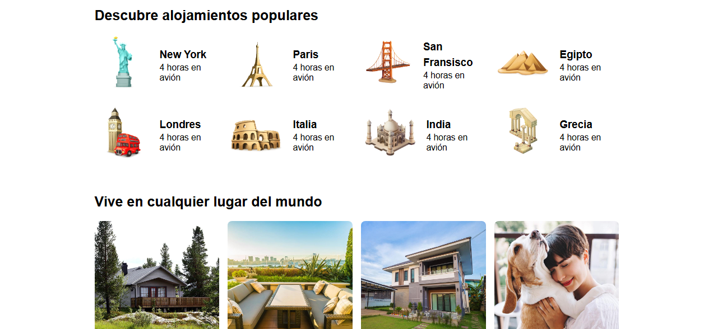
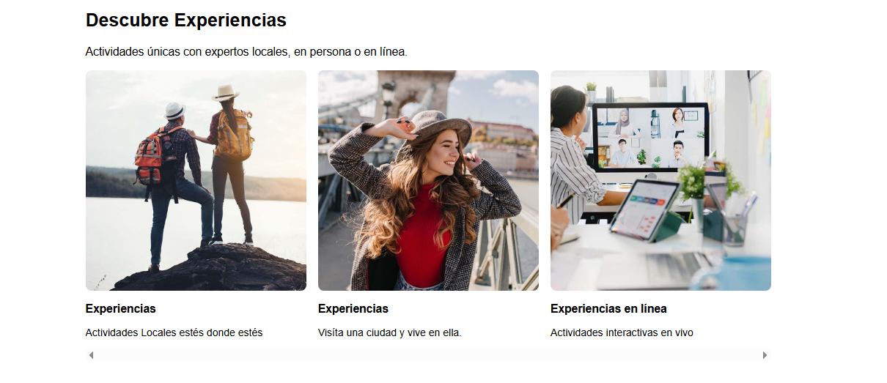
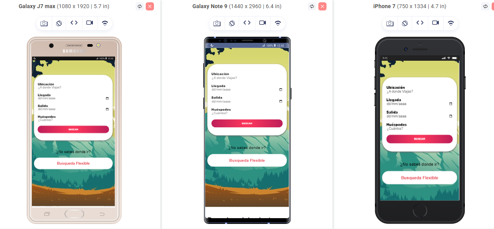
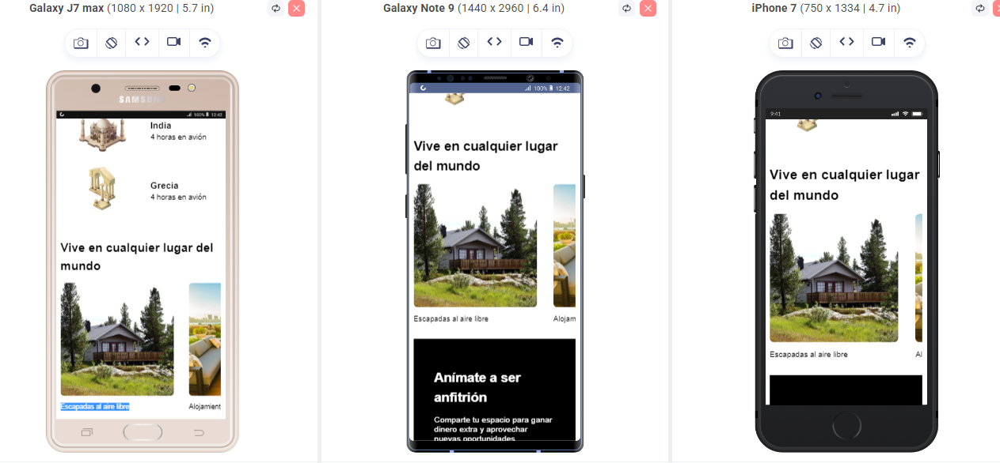
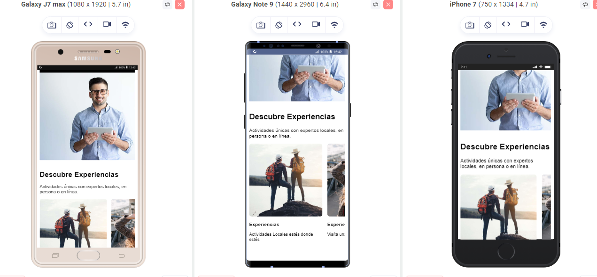

# 🏠 Airbnb Clone - Aplicación Web Responsiva

[](https://developer.mozilla.org/es/docs/Web/HTML)
[](https://developer.mozilla.org/es/docs/Web/CSS)
[](https://sass-lang.com/)
[](https://gulpjs.com/)

## 🌐 Demo en Vivo
**Visita el sitio web:** [Airbnb-clone](https://viajes-2025.netlify.app/)


## 📸 Capturas de Pantalla








## 📖 Descripción del Proyecto

**Airbnb Clone** es una aplicación web responsiva que replica la interfaz de usuario de Airbnb, desarrollada con las mejores prácticas de desarrollo frontend moderno. La aplicación presenta una interfaz elegante y funcional para la búsqueda de alojamientos, experiencias y destinos turísticos.

### ✨ Características Principales

- **Diseño Responsivo**: Adaptable a todos los dispositivos (móvil, tablet, desktop)
- **Interfaz Moderna**: Diseño limpio y profesional inspirado en Airbnb
- **Formulario de Búsqueda**: Sistema completo de reservas con campos para ubicación, fechas y huéspedes
- **Sección de Destinos**: Galería de destinos populares con información detallada
- **Experiencias**: Catálogo de experiencias turísticas únicas
- **Sección de Anfitriones**: Información para convertirse en anfitrión
- **Optimización de Imágenes**: Múltiples formatos (WebP, AVIF) para mejor rendimiento

## 🚀 Funcionalidades

### 🔍 Sistema de Búsqueda
- Formulario de reserva con validación
- Selección de ubicación de destino
- Calendario para fechas de llegada y salida
- Selector de número de huéspedes
- Búsqueda flexible para usuarios indecisos

### 🗺️ Destinos Populares
- Grid responsivo de destinos turísticos
- Información de distancia y tiempo de viaje
- Iconos representativos para cada destino
- Navegación intuitiva entre secciones

### 🎯 Experiencias y Anfitriones
- Catálogo de experiencias únicas
- Información para nuevos anfitriones
- Sección "Vive como un local" con opciones de vida local

## 🛠️ Tecnologías Utilizadas

### **Frontend**
- **HTML5**: Estructura semántica y accesible
- **CSS3**: Estilos avanzados y animaciones
- **Sass/SCSS**: Preprocesador CSS con arquitectura modular
- **CSS Grid & Flexbox**: Layouts modernos y responsivos

### **Build Tools & Optimización**
- **Gulp**: Automatización de tareas de build
- **PostCSS**: Post-procesamiento CSS con autoprefixer
- **CSSNano**: Minificación y optimización de CSS
- **Source Maps**: Debugging mejorado para desarrollo

### **Optimización de Imágenes**
- **Gulp-Imagemin**: Compresión automática de imágenes
- **WebP & AVIF**: Formatos modernos de imagen para mejor rendimiento
- **Optimización de calidad**: Balance entre calidad y tamaño de archivo

### **Metodología CSS**
- **BEM (Block Element Modifier)**: Arquitectura CSS escalable y mantenible
- **Arquitectura SCSS Modular**: Organización por componentes y funcionalidades

## 📁 Estructura del Proyecto

```
airbnb/
├── src/
│   ├── scss/
│   │   ├── base/           # Variables, mixins, normalización
│   │   ├── ui/             # Componentes de interfaz
│   │   │   ├── header/     # Estilos del encabezado
│   │   │   ├── contenido/  # Secciones principales
│   │   │   └── footer/     # Estilos del pie de página
│   │   └── app.scss        # Archivo principal SCSS
│   └── img/                # Imágenes fuente
├── build/                   # Archivos compilados
│   ├── css/                # CSS optimizado
│   └── img/                # Imágenes optimizadas
├── gulpfile.js             # Configuración de Gulp
└── package.json            # Dependencias del proyecto
```

## 🚀 Instalación y Uso

### Prerrequisitos
- Node.js (versión 14 o superior)
- npm o yarn

### Instalación
```bash
# Clonar el repositorio
git clone https://github.com/tu-usuario/airbnb-clone.git
cd airbnb-clone

# Instalar dependencias
npm install

# Ejecutar en modo desarrollo
npm run dev
```

### Scripts Disponibles
- `npm run dev`: Inicia el servidor de desarrollo con watch
- `gulp css`: Compila solo los archivos SCSS
- `gulp imagenes`: Optimiza las imágenes
- `gulp versionWebp`: Convierte imágenes a formato WebP
- `gulp versionAvif`: Convierte imágenes a formato AVIF

## 🎨 Características de Diseño

### **Sistema de Colores**
- Paleta de colores moderna y accesible
- Contraste optimizado para mejor legibilidad
- Consistencia visual en todos los componentes

### **Tipografía**
- Fuente **Lexend**: Optimizada para legibilidad en pantallas
- Jerarquía tipográfica clara y consistente
- Escalado responsivo de textos

### **Layout**
- **CSS Grid**: Para layouts complejos y responsivos
- **Flexbox**: Para alineación y distribución de elementos
- **Breakpoints**: Diseño mobile-first con media queries

## 📱 Responsividad

La aplicación está diseñada con un enfoque **mobile-first**, asegurando una experiencia óptima en todos los dispositivos:

- **Móvil**: < 768px
- **Tablet**: 768px - 1024px  
- **Desktop**: > 1024px

## ⚡ Rendimiento y Optimización

### **CSS**
- CSS minificado y optimizado
- Autoprefixer para compatibilidad entre navegadores
- Source maps para debugging en desarrollo

### **Imágenes**
- Compresión automática con Gulp-Imagemin
- Múltiples formatos (WebP, AVIF) para navegadores modernos
- Fallbacks para navegadores legacy
- Lazy loading optimizado

### **Build Process**
- Pipeline automatizado con Gulp
- Optimización automática en cada build
- Watch mode para desarrollo eficiente

## 🌐 Compatibilidad de Navegadores

- **Chrome**: Versión 90+
- **Firefox**: Versión 88+
- **Safari**: Versión 14+
- **Edge**: Versión 90+

## 📈 Métricas de Rendimiento

- **First Contentful Paint**: < 1.5s
- **Largest Contentful Paint**: < 2.5s
- **Cumulative Layout Shift**: < 0.1
- **First Input Delay**: < 100ms

## 🔧 Personalización

El proyecto está diseñado para ser fácilmente personalizable:

- **Variables SCSS**: Colores, tipografías y espaciados centralizados
- **Mixins**: Funciones reutilizables para patrones comunes
- **Arquitectura modular**: Fácil adición de nuevos componentes

## 🤝 Contribuciones

Las contribuciones son bienvenidas. Por favor:

1. Fork el proyecto
2. Crea una rama para tu feature (`git checkout -b feature/AmazingFeature`)
3. Commit tus cambios (`git commit -m 'Add some AmazingFeature'`)
4. Push a la rama (`git push origin feature/AmazingFeature`)
5. Abre un Pull Request

## 📄 Licencia

Este proyecto está bajo la Licencia ISC. Ver el archivo `LICENSE` para más detalles.

## 👨‍💻 Autor

**Javier Berchtold** - *JEB$DEV*

- **GitHub**: [@tu-usuario](https://github.com/tu-usuario)
- **LinkedIn**: [Javier Berchtold](https://linkedin.com/in/javier-berchtold)
- **Portfolio**: [jebdev.com](https://jebdev.com)

## 🙏 Agradecimientos

- Inspirado en el diseño de [Airbnb](https://airbnb.com)
- Comunidad de desarrolladores frontend
- Herramientas open source que hacen este proyecto posible

## 📞 Contacto

¿Tienes alguna pregunta o sugerencia? No dudes en contactarme:

- **Email**: javier@jebdev.com
- **Twitter**: [@jebdev](https://twitter.com/jebdev)
- **Discord**: JEB$DEV#1234

---

⭐ **Si este proyecto te gusta, ¡dale una estrella en GitHub!** ⭐

*Desarrollado con ❤️ por JEB$DEV*
